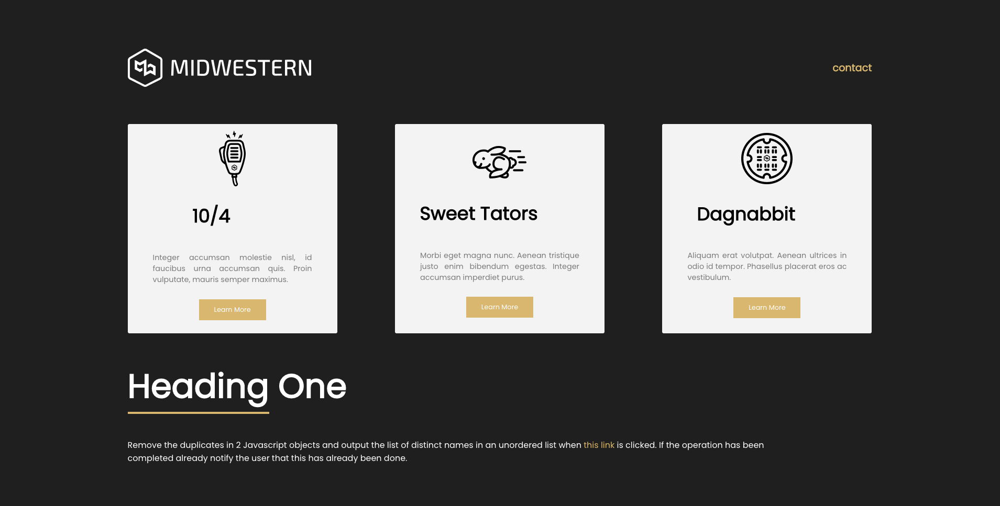
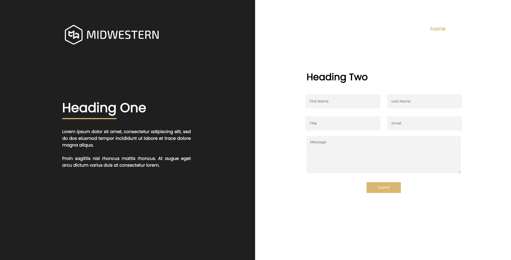

# Project Title
MWI Coding Challenge
## Table of Content:
- [Screenshots](#screenshots)
- [Technologies](#technologies)
- [Setup](#setup)
## Screenshots

- Home Page

- Contact

## Technologies
I used `React`, `CSS`, `Axios`, `Express`, `Node`, `postgreSQL`

## Setup
- download or clone the repository
- cd into API
- run `npm install`

## Once completed
- run npm start

